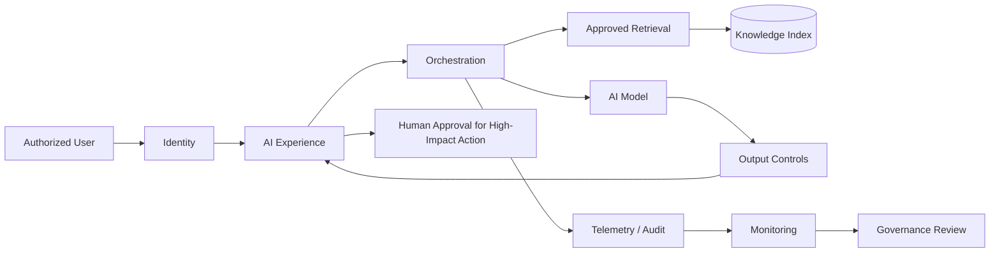

# Enterprise AI Architecture | Runtime-Governed AI Solution

> Conceptual portfolio architecture. No production government data, prompts, endpoints, credentials, or internal architecture is represented.

## Challenge
An AI assistant can produce an answer in seconds, while access violations, unsupported outputs, sensitive-data exposure, and inappropriate automated actions can occur at the same speed. Therefore, governance cannot exist only before deployment; controls must operate during the interaction and after it.

## Desired Result
Deliver useful AI responses from approved enterprise knowledge while maintaining identity-aware access, source traceability, safety controls, telemetry, and human accountability.

## Plan
1. Authenticate the user and preserve authorization context.
2. Restrict retrieval to approved knowledge sources.
3. Separate orchestration from the model layer.
4. Apply input/output and policy controls.
5. Require human review for consequential actions.
6. Log interactions, evaluation signals, and operational events.
7. Use monitoring to trigger review when risk thresholds change.

## Execution

## Runtime Controls
- Identity and authorization context
- Approved-source retrieval
- Least-privilege data access
- Grounding/source traceability
- Input/output safeguards
- Human-in-the-loop decision boundary
- Telemetry and audit events
- Performance and risk monitoring

## Demonstration Results
A fictional unauthorized knowledge request is blocked by access boundaries; a high-impact action is routed to human review; an evaluation or monitoring threshold can create a governance exception. The result is an architecture where speed does not remove accountability.

## Result Measures
Grounded-response rate • unsupported-output rate • access-control violations • human-review rate • evaluation pass rate • safety exception count • incident-response time • unresolved governance exceptions

## Career Alignment
AI Technical Program Manager • AI/Data Modernization Lead • AI Solutions Architect • Enterprise AI Consultant • AI Transformation Manager

Ultimately, I designed this architecture around a simple principle: AI should be fast at the task without making the organization slow to understand the risk.
