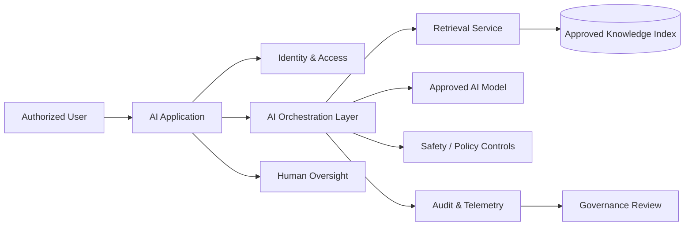

# Enterprise AI Architecture

AI implementation is not simply a model-selection exercise. I designed this conceptual architecture around the broader enterprise question: **How do you introduce AI capability without separating innovation from security, governance, data quality, and human accountability?**

This project reflects my AI Architecture and cybersecurity perspective while building on my existing experience in data, workflow automation, governance, analytics, and technical program delivery.

> No production government system, data, credentials, prompts, endpoints, or internal architecture is represented in this portfolio project.

## Use Case

A fictional enterprise wants an AI-enabled knowledge assistant that can respond to questions using approved organizational content. However, usefulness alone is not sufficient. The system must also respect identity, access, data boundaries, traceability, monitoring, and human oversight.

Consequently, the architecture separates the user experience from orchestration, retrieval, model interaction, controls, telemetry, and governance.

## Reference Architecture

## Architectural Position

From an architectural standpoint, I would not give the model unrestricted access to enterprise information simply because the technology makes it possible. By design, access should be constrained by identity, approved sources, business purpose, and governance requirements.

Moreover, high-impact actions should not become fully automated merely for efficiency. Human review remains an architectural control when the consequence of an incorrect action is material.

## Architecture Decisions

| Decision | Why I Would Make It |
|---|---|
| Retrieval over approved enterprise content | Improves grounding, traceability, and control over source material |
| Separate orchestration layer | Centralizes business rules, safeguards, routing, and provider abstraction |
| Human approval for consequential actions | Preserves accountability and creates a defensible decision boundary |
| Centralized telemetry | Enables operational monitoring, evaluation, investigation, and governance |
| No unrestricted direct data access | Reduces unnecessary exposure and reinforces least privilege |

## Delivery Artifacts

The architecture package would include a context diagram, logical architecture, data-flow diagram, AI use-case intake, risk register, architecture decision records, access-control matrix, evaluation plan, and operational monitoring plan.

Equally important, I would document the assumptions behind the design. Architecture becomes difficult to govern when teams can see *what* was built but cannot determine *why* a decision was made.

## Remote Delivery Capability

Architecture planning, design reviews, governance, requirements, documentation, backlog management, and technical stakeholder coordination are well suited to remote delivery when secure collaboration and approved development environments are available. Sensitive datasets or restricted environments may still require hybrid access.

## Skills Demonstrated

AI Architecture • Enterprise Architecture • Data Architecture • Cybersecurity • Governance • Requirements • Technical Program Leadership • Risk Management • Responsible AI

## Career Alignment

AI Technical Program Manager • AI / Data Modernization Lead • AI Solutions Architect • Enterprise AI Consultant • AI Transformation Manager

Ultimately, I view responsible AI architecture as the discipline of creating enough structure around innovation that the organization can scale it with confidence rather than simply experiment with it.
