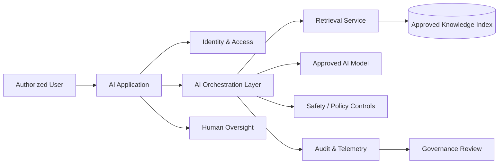

# Enterprise AI Architecture

A conceptual, vendor-neutral AI architecture portfolio project demonstrating how an enterprise can introduce AI capabilities while preserving governance, security, traceability, and human oversight.

> No production government system, data, credentials, prompts, endpoints, or internal architecture is represented here.

## Use Case

A fictional enterprise wants an AI-enabled knowledge assistant that can answer questions over approved organizational content while enforcing access controls and maintaining traceability.

## Reference Architecture

## Architecture Principles

- Identity-aware access
- Least privilege
- Approved data sources only
- Data minimization
- Retrieval traceability
- Human oversight for consequential actions
- Prompt/input and output controls
- Audit logging
- Model/use-case inventory
- Monitoring and incident response

## Architecture Decision Records

| Decision | Rationale |
|---|---|
| Retrieval over approved content | Reduces unsupported enterprise answers and improves traceability |
| Separate orchestration layer | Centralizes controls and model/provider abstraction |
| Human approval for high-impact actions | Preserves accountability |
| Central telemetry | Supports operational and governance monitoring |
| No direct unrestricted data access | Reduces exposure and enforces policy boundaries |

## Delivery Artifacts

- Context diagram
- Logical architecture
- Data-flow diagram
- AI use-case intake template
- Risk register
- Architecture decision log
- Access-control matrix
- Evaluation plan
- Operational monitoring plan

## Remote Delivery Capability

Architecture planning, design reviews, governance, requirements, documentation, backlog management, and technical stakeholder coordination can be performed remotely when secure collaboration and approved development environments are available.

## Skills Demonstrated

AI Architecture • Enterprise Architecture • Data Architecture • Cybersecurity Awareness • Governance • Requirements • Technical Program Leadership • Risk Management • Responsible AI

## Career Alignment

AI Technical Program Manager • AI / Data Modernization Lead • AI Solutions Architect • Enterprise AI Consultant • AI Transformation Manager
