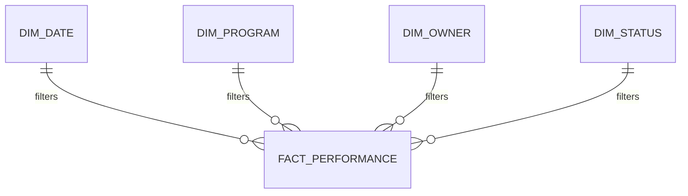

# Executive BI Analytics Portfolio

A fictional executive analytics solution demonstrating dimensional modeling, KPI design, Power BI reporting, DAX logic, forecasting, data quality, and leadership decision support.

## Star Schema



## Executive KPI Catalog

- Overall Program Health
- Cost Variance
- Schedule Variance
- Milestone Completion Rate
- Overdue Milestone Count
- Open Risk Exposure
- Critical Issue Count
- Corrective-Action Completion Rate
- Upcoming 30-Day Deadlines
- Upcoming 60-Day Deadlines
- Upcoming 90-Day Deadlines
- Data Quality Exception Count

## Example DAX Patterns

```DAX
Overdue Items =
CALCULATE(
    COUNTROWS(FactPerformance),
    FactPerformance[DueDate] < TODAY(),
    FactPerformance[Status] <> "Closed"
)
```

```DAX
Completion Rate =
DIVIDE(
    [Completed Items],
    [Total Items],
    0
)
```

## Dashboard Pages

1. Executive Overview
2. Trends & Timelines
3. Program Health
4. Risks & Issues
5. Milestones
6. 30/60/90 Forecast
7. Data Quality

## Remote Delivery Capability

Power BI development, DAX, Power Query, SQL analysis, data modeling, dashboard design, requirements, KPI workshops, testing, documentation, and executive reporting are highly compatible with remote work.

## Skills Demonstrated

Power BI • DAX • Power Query • SQL • Dimensional Modeling • KPI Design • Forecasting • Data Quality • Executive Storytelling • Requirements Analysis

## Career Alignment

BI / Data Analytics Lead • Senior BI Developer • Senior Data Analyst • Data Analytics Program Manager • Financial Data / BI Analyst
