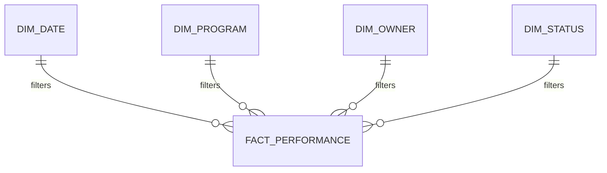

# Executive BI Analytics Portfolio

I built this fictional executive analytics project around a recurring data challenge: organizations can have a large volume of reporting and still lack a clear picture of performance. More dashboards do not necessarily create better decisions. The information has to be structured around the questions leadership is actually responsible for answering.

## Challenge

A fictional program office receives status information from multiple sources. Metrics are calculated differently across teams, overdue items are difficult to identify, risks and milestones are reported separately, and leadership spends time reconciling numbers rather than evaluating performance.

Furthermore, the underlying data is operationally structured rather than analytically structured, making trend analysis and consistent KPI calculation difficult.

## Solution

I designed a dimensional BI model that separates reusable dimensions from performance facts and creates one governed KPI layer for executive reporting. Consequently, the same definition of program health, overdue work, completion, risk exposure, and upcoming deadlines can be used across the reporting experience.



## Challenge-to-Solution Alignment

| Reporting Challenge | Solution I Designed |
|---|---|
| Different teams calculate metrics differently | Central KPI definitions and reusable DAX measures |
| Leadership cannot quickly see what requires attention | Exception-driven executive overview |
| Historical trends are difficult to analyze | Date dimension and time-based measures |
| Program, owner, and status reporting is inconsistent | Conformed dimensions |
| Overdue work is buried in detail | Explicit overdue logic and drill-through |
| Upcoming deadlines are reactive | 30/60/90-day forecasting views |
| Data problems reduce trust | Data-quality exception monitoring |
| Reports explain what happened but not where to investigate | Portfolio-to-program drill-down design |

## Executive KPI Catalog

The model includes Overall Program Health, Cost Variance, Schedule Variance, Milestone Completion Rate, Overdue Milestone Count, Open Risk Exposure, Critical Issue Count, Corrective-Action Completion Rate, Upcoming 30/60/90-Day Deadlines, and Data Quality Exception Count.

## Example DAX Patterns

```DAX
Overdue Items =
CALCULATE(
    COUNTROWS(FactPerformance),
    FactPerformance[DueDate] < TODAY(),
    FactPerformance[Status] <> "Closed"
)
```

```DAX
Completion Rate =
DIVIDE(
    [Completed Items],
    [Total Items],
    0
)
```

## Why This Solution Fits the Challenge

The objective is not to place every available metric on one screen. Instead, the dashboard should establish a hierarchy of information: What is the overall condition? What changed? What requires attention? What is driving it? Who owns the next action?

Therefore, I would structure the experience across Executive Overview, Trends & Timelines, Program Health, Risks & Issues, Milestones, 30/60/90 Forecast, and Data Quality views.

## Remote Delivery Capability

Power BI development, DAX, Power Query, SQL analysis, data modeling, dashboard design, requirements, KPI workshops, testing, documentation, and executive reporting are highly compatible with remote work.

## Skills Demonstrated

Power BI • DAX • Power Query • SQL • Dimensional Modeling • KPI Design • Forecasting • Data Quality • Executive Storytelling • Requirements Analysis

## Career Alignment

BI / Data Analytics Lead • Senior BI Developer • Senior Data Analyst • Data Analytics Program Manager • Financial Data / BI Analyst

Ultimately, this project reflects how I approach BI: the dashboard is the visible layer, but the real solution is the governed decision logic underneath it.
