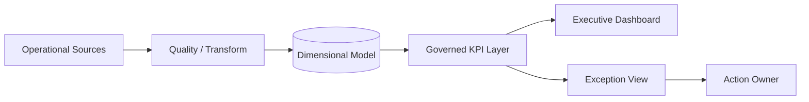

# Executive BI Analytics | Current-State Decision Support

## Challenge
Organizations can have numerous dashboards and still react late because measures are inconsistent, refresh timing is unclear, exceptions are buried, and the report does not identify the owner or next action.

## Desired Result
Create one governed decision layer that shows current health, what changed, what is approaching, what requires intervention, and which underlying record is driving the signal.

## Plan
1. Define conformed Date, Program, Owner, and Status dimensions.
2. Establish one KPI definition for each executive measure.
3. Define source refresh and data-quality controls.
4. Build exception and trend measures before designing visuals.
5. Add 30/60/90-day outlook and drill-through.
6. Measure data freshness and decision-response performance.

## Execution

## Current-State Controls
Data freshness indicator • refresh failure monitoring • governed DAX measures • overdue logic • health thresholds • exception views • drill-through • 30/60/90 forecast • data-quality exceptions

## Demonstration Results
A fictional overdue milestone or critical risk can change the executive health indicator after refresh and immediately appear in the exception view. Leadership can then drill to the program, owner, due date, and underlying condition rather than reconciling separate reports.

## Result Measures
Data freshness • refresh success • overdue count • critical risk exposure • milestone completion • corrective-action completion • exception aging • time from condition change to dashboard visibility

## Career Alignment
BI/Data Analytics Lead • Senior BI Developer • Senior Data Analyst • Data Analytics Program Manager • Financial Data/BI Analyst

The dashboard is the visible layer. The real solution is the governed logic and operating cadence that determine whether leadership can trust what it sees.
