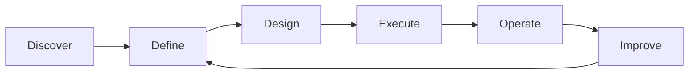

# Federal Digital Transformation Playbook | Plan-to-Execution

> Fictional portfolio framework for demonstrating modernization leadership.

## Challenge
Modernization programs can begin with a technology choice before the current operating problem is fully understood. Consequently, teams may digitize unnecessary steps, reproduce weak controls, create duplicate solutions, or deliver a technically successful product that users do not adopt.

## Desired Result
Create a repeatable modernization approach that connects business pain, measurable outcomes, architecture, delivery, adoption, and continuous improvement.

## Plan
### 1. Discover
Map current process, stakeholders, systems, data, pain points, controls, dependencies, and baseline measures.

### 2. Define
Translate the problem into desired outcomes, requirements, success measures, target-state process, architecture principles, and prioritized backlog.

### 3. Design
Create the data model, workflow, security model, integration pattern, analytics layer, governance, and release strategy.

### 4. Execute
Deliver iteratively through configured environments, testing, demonstrations, UAT, release gates, documentation, and stakeholder feedback.

### 5. Operate
Monitor usage, failures, data quality, cycle time, exceptions, SLA performance, and support demand.

### 6. Improve
Use operational evidence to reprioritize backlog, refine controls, retire redundant steps, and scale successful patterns.

## Challenge-to-Execution Example

| Challenge | Plan | Execution | Demonstration Result |
|---|---|---|---|
| Manual handoffs | Map delay points and ownership | Automate routing with state-based workflow | Reduced ambiguity between handoffs |
| Duplicate reporting | Define source-of-truth and KPI layer | Consolidate data and reusable measures | One governed performance view |
| Late risk visibility | Define thresholds and escalation | Event/scheduled monitoring and alerts | Earlier exception awareness |
| Low adoption | Include users in design/UAT | Iterative demos and feedback | Better fit between workflow and user need |
| Production instability | Define ALM/support model | Dev/Test/Prod and release gates | More controlled change |

## Real-Time Operating Measures
Cycle time • adoption • exception aging • automation failure rate • data-quality exceptions • SLA performance • support volume • deployment success • time-to-decision

## Career Alignment
Digital Transformation Lead • Senior Technical Program Manager • Power Platform Solution Architect • Data Analytics Program Manager • AI/Data Modernization Lead

Ultimately, I approach modernization as an operating-model change supported by technology. The execution is successful when the organization can see a measurable difference in how work moves, how risk is surfaced, and how decisions are made.
