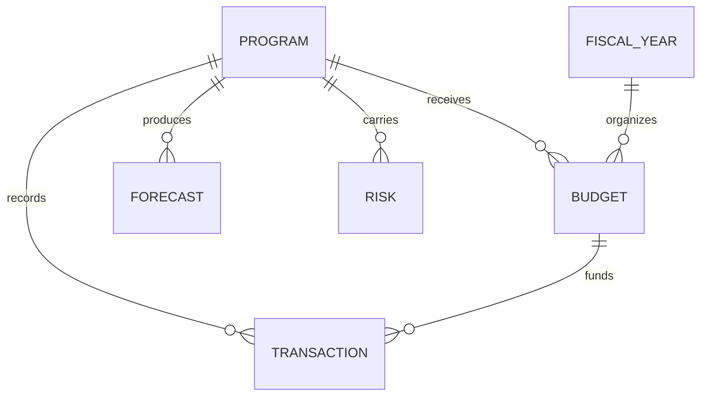

# Federal Financial Management Analytics

A fictional federal-style financial analytics solution demonstrating budget execution, variance analysis, forecasting, data quality, and executive decision support.

> All data and organizations in this project are fictional.

## Business Objective

Create a governed analytical model that allows program and financial leaders to understand planned funding, actual obligations/expenditures, execution rates, variances, forecasted requirements, and emerging financial risks.

## Core Data Model

- Programs
- Fiscal Years
- Appropriations / Funding Categories
- Budget Authority
- Commitments
- Obligations
- Expenditures
- Forecasts
- Variance Explanations
- Program Milestones
- Financial Risks



## Executive KPIs

- Total Budget Authority
- Obligations to Date
- Expenditures to Date
- Unobligated Balance
- Execution Rate
- Budget Variance
- Forecast at Completion
- Funding Risk
- 30/60/90-Day Requirement Forecast
- Data Quality Exception Count

## Example Calculations

```text
Execution Rate = Obligations / Budget Authority
Unobligated Balance = Budget Authority - Obligations
Variance = Actual / Forecast comparison
Forecast Risk = projected requirement exceeding available balance
```

## Remote Delivery Capability

Financial modeling, Power BI development, SQL/Excel analysis, forecasting, requirements, documentation, dashboard reviews, and stakeholder briefings can be delivered remotely when approved systems and data are accessible through secure environments.

## Skills Demonstrated

Power BI • DAX • Power Query • Excel • SQL • Data Modeling • Financial Analytics • Forecasting • Data Governance • Executive Reporting • Requirements Analysis

## Career Alignment

Financial Data / BI Analyst • Financial Systems Analyst • Financial Management Business Analyst • Financial Management Modernization Consultant • Program Financial Analyst
