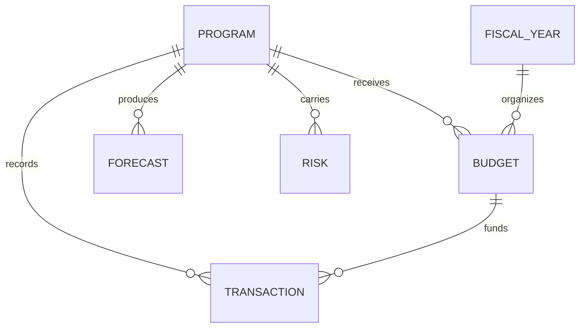

# Federal Financial Management Analytics

I designed this fictional federal financial-management project around a problem that is easy to underestimate: having financial data does not automatically mean leadership has financial visibility. The real value comes from connecting funding, execution, forecasts, program activity, and risk in a way that makes the next decision clearer.

> All organizations, programs, transactions, and financial values in this project are fictional.

## Why I Built This

My objective is to demonstrate how my existing data, BI, program-management, and modernization background can translate into financial-management environments. More specifically, this model focuses on the analytical layer between raw financial records and executive decision-making.

Consequently, I structured the solution to answer practical questions: What funding is available? What has been obligated? Where is execution deviating from plan? What is likely to happen by year-end? Which programs require leadership attention now rather than later?

## Analytical Model

The conceptual model includes Programs, Fiscal Years, Appropriations/Funding Categories, Budget Authority, Commitments, Obligations, Expenditures, Forecasts, Variance Explanations, Program Milestones, and Financial Risks.



## Executive Measures

The dashboard layer is designed around Total Budget Authority, Obligations to Date, Expenditures to Date, Unobligated Balance, Execution Rate, Budget Variance, Forecast at Completion, Funding Risk, 30/60/90-Day Requirements, and Data Quality Exceptions.

```text
Execution Rate = Obligations / Budget Authority
Unobligated Balance = Budget Authority - Obligations
Variance = Actual compared with forecast or approved baseline
Forecast Risk = projected requirement exceeds available resources
```

## My Design Perspective

From a data perspective, the model must preserve traceability between the financial transaction and the program it supports. Equally important, from a leadership perspective, the reporting layer should surface exceptions rather than force decision-makers to search for them.

Therefore, I would design the Power BI experience so that a leader can move from portfolio-level execution to a specific program, understand the variance, review the explanation, and identify whether action is required.

## Remote Delivery Capability

This work is highly compatible with remote delivery because financial modeling, Power BI development, SQL/Excel analysis, forecasting, requirements analysis, documentation, dashboard reviews, and stakeholder briefings can be completed through approved secure environments. Where a contract requires restricted financial systems or classified data, the delivery model may shift to hybrid or on-site access.

## Skills Demonstrated

Power BI • DAX • Power Query • Excel • SQL • Data Modeling • Financial Analytics • Forecasting • Data Governance • Executive Reporting • Requirements Analysis

## Career Alignment

Financial Data / BI Analyst • Financial Systems Analyst • Financial Management Business Analyst • Financial Management Modernization Consultant • Program Financial Analyst

Ultimately, this project demonstrates how I would use my technical background to make financial information more structured, explainable, and decision-ready rather than simply producing another report.
