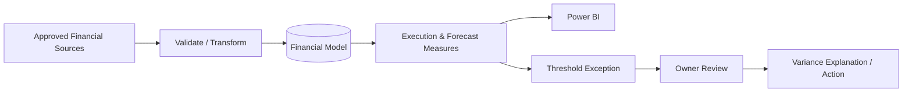

# Federal Financial Management Analytics | Real-Time Decision Support

> Fictional portfolio solution. Results are simulated targets, not claims about an actual government customer.

## Challenge
Financial leaders may receive budget, obligation, expenditure, forecast, and program information on different schedules. Consequently, a variance can exist before it becomes visible in the reporting package.

## Desired Result
Give program and financial leadership a current, traceable view of execution and immediately surface conditions that require explanation or action.

## Plan
1. Define common Program, Fiscal Year, Funding, Transaction, Forecast, Milestone, and Risk keys.
2. Establish approved ingestion cadence by source.
3. Calculate execution, balance, forecast, and variance measures consistently.
4. Define thresholds for emerging funding risk.
5. Route exceptions to owners and expose them in the executive BI layer.
6. Measure whether variance identification and response become faster.

## Execution
Power Query/SQL standardizes incoming records; the semantic model connects financial activity to programs; DAX calculates current execution and forecast indicators; Power BI surfaces exceptions; automation can notify owners when defined thresholds are crossed.

## Real-Time / Operational Controls
- Scheduled or approved-source refresh
- Data-quality validation before reporting
- Variance threshold flags
- Forecast-to-available-funding comparison
- 30/60/90-day requirement views
- Owner and explanation tracking

## Demonstration Results
A simulated threshold breach can move from source refresh to an executive exception view without rebuilding a monthly spreadsheet. A leader can identify the affected program, see the amount and direction of variance, review the forecast, and determine who owns the response.

## Result Measures
Refresh success rate • data-quality exception count • execution rate • unobligated balance • forecast variance • time-to-variance-identification • unresolved financial exceptions • 30/60/90-day funding exposure

## Career Alignment
Financial Data/BI Analyst • Financial Systems Analyst • Financial Management Business Analyst • Financial Modernization Consultant • Program Financial Analyst

Ultimately, the solution is designed to move financial reporting from retrospective compilation toward active decision support.
