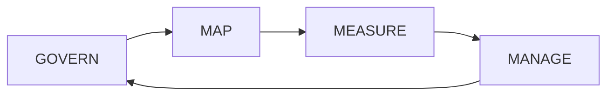

# AI RMF Governance Portfolio

I built this project around a governance reality that organizations are increasingly facing: AI can move from experimentation to operational use faster than policy, ownership, controls, and monitoring can mature around it. Consequently, the challenge is not simply whether an AI capability performs well. The challenge is whether the organization can explain who owns it, what risks were evaluated, what evidence supports deployment, and what happens when performance or context changes.

> This is an educational portfolio implementation organized around the NIST AI Risk Management Framework functions: Govern, Map, Measure, and Manage. It is not an official NIST assessment or government AI system.

## Challenge

A fictional enterprise is introducing AI use cases across multiple business functions. However, there is no consistent intake process, AI inventory, risk-rating method, approval record, monitoring plan, or escalation path. Moreover, technical teams and business owners are evaluating risk differently, which creates inconsistent decision-making and limited auditability.

## Solution

I designed a governance operating model that connects AI use-case intake to four continuous functions: **Govern, Map, Measure, and Manage**. By design, each use case moves through a traceable set of governance decisions rather than relying on informal approval.

## Challenge-to-Solution Alignment

| Governance Challenge | Solution I Designed |
|---|---|
| No clear ownership | AI governance charter and RACI |
| AI use cases are not centrally tracked | AI system/use-case inventory |
| Risk is assessed inconsistently | Standardized context and impact assessment |
| Performance evidence is fragmented | Evaluation plan and test-evidence register |
| High-risk issues lack escalation | Risk register, mitigation plan, and escalation workflow |
| Deployment decisions are difficult to defend | Formal approval and deployment decision record |
| Risk changes after launch | Monitoring metrics and periodic review schedule |

## GOVERN

Establish accountability, policy, roles, documentation, escalation, inventory, and risk tolerance. In practice, this becomes the management layer that determines who has authority to approve, challenge, pause, or retire an AI use case.

## MAP

Document the use case, intended outcomes, users, affected stakeholders, data sources, dependencies, and potential harms. Equally important, the mapping process establishes context before technical performance is evaluated.

## MEASURE

Define how performance, reliability, security, privacy, bias/fairness considerations, explainability, and other relevant risks will be evaluated. Accordingly, evidence becomes part of the governance decision rather than an afterthought.

## MANAGE

Prioritize risk, select treatments, approve or restrict deployment, monitor change, respond to incidents, and retire systems responsibly.

## Fictional AI Risk Register

| Risk | Example Control | Evidence |
|---|---|---|
| Unsupported output | Retrieval grounding and evaluation | Evaluation report |
| Sensitive-data exposure | Access control and data minimization | Access review |
| Inappropriate automated action | Human approval | Workflow log |
| Performance degradation | Monitoring thresholds | KPI dashboard |
| Unapproved use case | Intake and governance gate | Approval record |

## Why This Solution Fits the Challenge

The governance model creates continuity between policy, architecture, data, security, and operational monitoring. Therefore, the organization can evaluate AI as an enterprise capability rather than as a collection of disconnected experiments.

## Remote Delivery Capability

Governance frameworks, policy analysis, risk registers, control mapping, documentation, use-case reviews, assessments, and governance meetings are strongly compatible with remote delivery.

## Skills Demonstrated

Responsible AI • AI Governance • AI Risk • Cybersecurity • Data Governance • Auditability • Controls • Policy-to-Technology Translation • Executive Communication

## Career Alignment

AI Governance / Responsible AI Lead • AI Risk Consultant • AI Technical Program Manager • Data Governance Lead • AI Modernization Lead

Ultimately, this project demonstrates how I would give AI innovation a structure that leadership can govern, defend, and scale.
