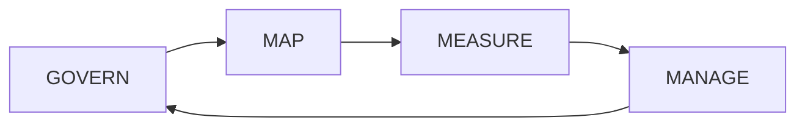

# AI RMF Governance Portfolio

A fictional responsible-AI governance project organized around the NIST AI Risk Management Framework functions: **Govern, Map, Measure, and Manage**.

> This project is an educational portfolio implementation and does not represent an official NIST assessment, certification, or government AI system.

## Governance Operating Model

## GOVERN

Establish accountability, policy, roles, documentation, escalation, inventory, and risk tolerances.

Example artifacts:
- AI governance charter
- AI system/use-case inventory
- Roles and responsibilities matrix
- Policy/control register
- Exception and escalation process

## MAP

Understand the use case, users, context, intended outcomes, affected stakeholders, data, dependencies, and potential harms.

Example artifacts:
- Use-case intake
- Context assessment
- Stakeholder map
- Data-source inventory
- Impact assessment

## MEASURE

Define how performance, reliability, security, privacy, bias/fairness considerations, explainability, and other risks will be evaluated.

Example artifacts:
- Evaluation plan
- Risk indicators
- Test evidence register
- Quality thresholds
- Monitoring metrics

## MANAGE

Prioritize identified risks, select treatments, approve deployment decisions, monitor changes, respond to incidents, and retire systems responsibly.

Example artifacts:
- AI risk register
- Mitigation plan
- Deployment decision record
- Incident workflow
- Periodic review schedule

## Fictional AI Risk Register

| Risk | Example Control | Evidence |
|---|---|---|
| Unsupported output | Retrieval grounding + evaluation | Evaluation report |
| Sensitive-data exposure | Access control + data minimization | Access review |
| Inappropriate automated action | Human approval | Workflow log |
| Performance degradation | Monitoring thresholds | KPI dashboard |
| Unapproved use case | Intake/governance gate | Approval record |

## Remote Delivery Capability

Governance frameworks, policy analysis, risk registers, control mapping, documentation, use-case reviews, assessments, and governance meetings are strongly compatible with remote delivery.

## Skills Demonstrated

Responsible AI • AI Governance • AI Risk • Cybersecurity • Data Governance • Auditability • Controls • Policy-to-Technology Translation • Executive Communication

## Career Alignment

AI Governance / Responsible AI Lead • AI Risk Consultant • AI Technical Program Manager • Data Governance Lead • AI Modernization Lead
