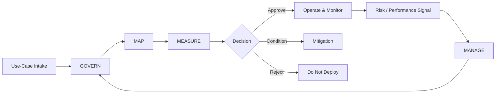

# AI RMF Governance | Continuous Risk Operations

> Fictional educational portfolio implementation organized around NIST AI RMF Govern, Map, Measure, and Manage. It is not an official assessment or certification.

## Challenge
AI risk is not static. A use case can be acceptable at approval and later change because of new data, model behavior, users, business context, performance degradation, or incidents. A one-time governance checklist therefore creates a gap between approval and operation.

## Desired Result
Create a continuous governance cycle where AI ownership, context, evidence, monitoring, mitigation, and deployment decisions remain visible throughout the lifecycle.

## Plan
1. Register every use case and accountable owner.
2. Map purpose, stakeholders, data, impact, and dependencies.
3. Define evaluation measures and risk thresholds.
4. Approve, condition, or reject deployment based on evidence.
5. Monitor operational signals after deployment.
6. Trigger mitigation, escalation, reassessment, or retirement when conditions change.

## Execution

## Continuous Controls
AI inventory • ownership/RACI • context assessment • evaluation evidence • risk register • approval record • monitoring thresholds • incident/escalation workflow • periodic reassessment • retirement decision

## Demonstration Results
A fictional AI use case that passes initial review can later generate a monitoring exception. That signal is connected back to the risk record, owner, mitigation, and governance decision rather than remaining only in a technical log.

## Result Measures
Use cases with named owners • assessment completion rate • open high-risk findings • evaluation pass rate • monitoring exceptions • time-to-mitigation • overdue reassessments • unresolved incidents

## Career Alignment
AI Governance/Responsible AI Lead • AI Risk Consultant • AI Technical Program Manager • Data Governance Lead • AI Modernization Lead

The operating principle is continuity: governance should remain active for as long as the AI capability remains active.
