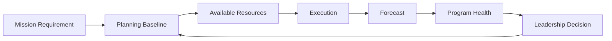

# PPBE Program Analytics | Planning-to-Execution Decision Support

> Fictional educational portfolio model. It does not represent an official PPBE product or actual government budget data.

## Challenge
Requirements, planned resources, available funding, execution, milestones, and program risk can be discussed in separate products. As conditions change, leadership may see the pieces without seeing the effect of one change on the broader program picture.

## Desired Result
Create a decision-support layer that connects planning assumptions to current execution so resource pressure, schedule risk, and emerging unfunded needs are visible early enough for leadership action.

## Plan
1. Establish Program/FY/Requirement/Funding relationships.
2. Capture planning baseline and current execution separately.
3. Define health thresholds based on funding, schedule, milestone, and risk conditions.
4. Calculate 30/60/90-day forecast exposure.
5. Maintain a decision log for exceptions requiring leadership action.
6. Reassess health as execution conditions change.

## Execution
Fictional planning and execution records feed a governed analytical model. Power BI calculates variance and program health; scheduled refresh updates the decision layer; threshold logic identifies programs that move from normal to emerging or critical conditions.

## Real-Time / Operational Controls
- Baseline versus current-state separation
- Evidence-based Green/Amber/Red thresholds
- Funding and schedule variance
- Unfunded requirement flags
- 30/60/90-day outlook
- Decision-required indicator
- Refresh-driven health recalculation

## Demonstration Results
When a fictional funding, milestone, or forecast condition changes, the program-health indicator recalculates and the affected program can move into an exception view. Consequently, leadership can investigate the driver rather than waiting for the next manually assembled status package.

## Result Measures
Funding variance • execution rate • forecast variance • unfunded requirement exposure • milestone risk • programs requiring decisions • time from threshold breach to visibility

## Career Alignment
PPBE Analyst/Consultant • Business Financial Manager • Resource Management Analyst • Senior Program Analyst • Program Financial Analyst

The value of the model is the connection between planning and execution: a plan becomes operationally useful when leadership can see when reality begins to diverge from it.
