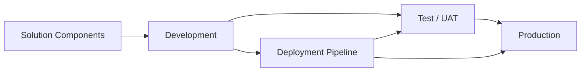

# Power Platform Enterprise Architecture

I designed this portfolio project around a challenge I see as larger than application development: an organization can build a successful Power App and still create long-term risk if environment strategy, ownership, deployment, data, security, and governance are not designed with it.

## Challenge

A fictional enterprise has multiple low-code applications being developed independently. Solutions rely on inconsistent naming, direct production changes, unclear ownership, unmanaged connectors, and limited lifecycle documentation. As adoption grows, so does the risk of duplicated solutions, broken dependencies, inappropriate data movement, and difficult production support.

## Solution

Rather than solving the problem app by app, I designed an enterprise Power Platform architecture that separates **experience, business logic, data, analytics, integration, governance, and security**. Moreover, the solution introduces a structured Dev → Test/UAT → Production lifecycle so changes can be validated before they affect end users.

## Challenge-to-Solution Alignment

| Enterprise Challenge | Solution I Designed |
|---|---|
| Direct production development | Separate Dev, Test/UAT, and Production environments |
| Inconsistent deployments | Solution-aware ALM and deployment pipeline |
| Hard-coded environment dependencies | Environment variables and connection references |
| Unclear ownership | Named business and technical owners |
| Uncontrolled connectors/data movement | Connector governance and DLP policies |
| Excessive access | Role-based access and least-privilege design |
| Limited production traceability | Versioning, release notes, audit logging, and change control |
| Apps remain after business need ends | Application inventory and lifecycle/retirement plan |
| Support depends on one developer | Documentation, ownership, support model, and continuity planning |

## Architecture Layers

1. **Experience** — Power Apps and Teams
2. **Business Logic** — Power Fx and Power Automate
3. **Data** — Dataverse, SharePoint, and approved enterprise sources
4. **Analytics** — Power BI, Power Query, and DAX
5. **Integration** — connectors, APIs, and controlled interfaces
6. **Governance** — environments, DLP, ownership, naming, and lifecycle
7. **Security** — identity, roles, least privilege, and auditability

## Why This Solution Fits the Challenge

From an architectural standpoint, governance should not be added after adoption becomes difficult to control. It should be embedded into how solutions are created, promoted, supported, and retired. Consequently, the model allows development speed without treating production stability and security as secondary concerns.

## Remote Delivery Capability

Solution architecture, Power Apps/Automate configuration, Power Fx, governance, data modeling, documentation, testing, design reviews, and stakeholder workshops are highly remote-capable when authorized tenant access is available.

## Skills Demonstrated

Power Platform • Power Apps • Power Automate • Power Fx • Dataverse • SharePoint • Power BI • ALM • Governance • Security • Solution Architecture

## Career Alignment

Power Platform Solution Architect • Senior Power Platform Developer • Automation / Workflow Solutions Lead • Digital Transformation Lead • Business Systems Analyst

Ultimately, this project demonstrates my transition from thinking about an application as a standalone build to thinking about the full enterprise lifecycle around the application.
