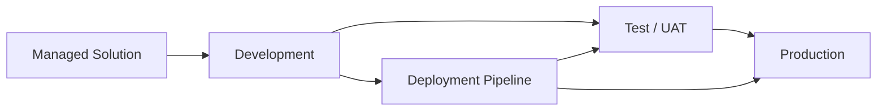

# Power Platform Enterprise Architecture

A sanitized reference architecture demonstrating enterprise Power Platform solution design, environment strategy, application lifecycle management, governance, security, automation, data, and reporting.

## Environment Strategy

## Architecture Layers

1. **Experience** — Power Apps and Teams
2. **Business Logic** — Power Fx and Power Automate
3. **Data** — Dataverse / SharePoint / approved enterprise sources
4. **Analytics** — Power BI, Power Query, DAX
5. **Integration** — connectors, APIs, controlled interfaces
6. **Governance** — environments, DLP, ownership, naming, lifecycle
7. **Security** — identity, roles, least privilege, auditability

## ALM Controls

- Separate development, test/UAT, and production environments
- Solution-aware components
- Environment variables
- Connection references
- Versioning
- Deployment validation
- Release notes
- Rollback planning
- Production change control

## Governance Checklist

- Named business and technical owners
- Approved connectors
- DLP policies
- Role-based access
- Data classification awareness
- Audit logging
- Support model
- Application inventory
- Lifecycle/retirement plan
- Business continuity considerations

## Remote Delivery Capability

Solution architecture, Power Apps/Automate configuration, Power Fx, governance, data modeling, documentation, testing, design reviews, and virtual stakeholder workshops are highly remote-capable when tenant access is authorized.

## Skills Demonstrated

Power Platform • Power Apps • Power Automate • Power Fx • Dataverse • SharePoint • Power BI • ALM • Governance • Security • Solution Architecture

## Career Alignment

Power Platform Solution Architect • Senior Power Platform Developer • Automation / Workflow Solutions Lead • Digital Transformation Lead • Business Systems Analyst
