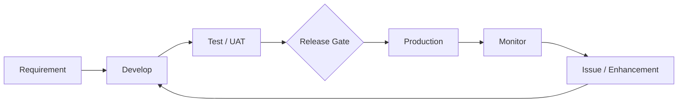

# Power Platform Enterprise Architecture | Controlled Operational Delivery

## Challenge
Low-code solutions can move from idea to production quickly. Without an operating model, however, the same speed can create direct production changes, broken dependencies, uncontrolled connectors, unclear ownership, duplicated applications, and slow incident response.

## Desired Result
Preserve development speed while creating a controlled path from requirement to release, monitoring, support, and retirement.

## Plan
1. Separate Dev, Test/UAT, and Production.
2. Package components in solutions with environment variables and connection references.
3. Define ownership, DLP, security roles, naming, and support expectations.
4. Validate deployments before production promotion.
5. Monitor flow/application failures and production changes.
6. Maintain release, rollback, and retirement procedures.

## Execution

## Operational Controls
- Dev/Test/Prod separation
- Managed solution strategy
- Environment variables and connection references
- DLP and approved connectors
- Least-privilege roles
- Release validation
- Version/release history
- Failure monitoring and ownership
- Rollback path
- Application inventory and retirement

## Demonstration Results
A simulated change moves through validation before production rather than being edited directly in the live app. A failed automation can be surfaced to an owner, while environment-specific connections remain configurable rather than hard-coded.

## Result Measures
Deployment success rate • failed-flow count • mean time to acknowledge production issues • rollback frequency • applications with named owners • unauthorized connector exceptions • UAT defect count

## Career Alignment
Power Platform Solution Architect • Senior Power Platform Developer • Automation/Workflow Solutions Lead • Digital Transformation Lead • Business Systems Analyst

Ultimately, enterprise low-code maturity is not measured by how many apps can be built. It is measured by whether the organization can change them safely, support them reliably, and retire them deliberately.
