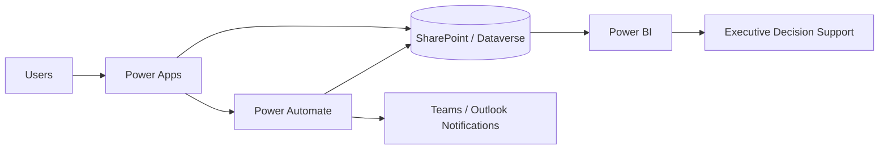

# Faith Paulding | Federal Digital Transformation Portfolio

**Data & BI • Power Platform • AI Architecture • Cybersecurity • Financial Management Modernization**

I built this portfolio to show more than a list of tools. My work is centered on a larger question: **How do you take a fragmented business problem, understand the operational risk behind it, and translate it into a solution that leadership can actually use?**

My approach sits at the intersection of technical delivery, data strategy, program management, governance, and modernization. Consequently, each project in this repository is designed to demonstrate not only *what* I can build, but also *how I think* about architecture, controls, data quality, executive visibility, scalability, and long-term adoption.

> **Portfolio integrity statement:** Every organization, user, financial record, audit record, metric, screenshot, workflow, and dataset presented here is fictional or intentionally sanitized for demonstration. No classified, controlled, proprietary, customer-sensitive, or government-sensitive information is included.

## My Professional Lens

From a technical standpoint, I work across Microsoft Power Platform, Power BI, automation, data modeling, SQL, analytics, governance, and enterprise workflow design. Equally important, I approach technology through the lens of program outcomes: the solution has to improve visibility, reduce manual effort, strengthen controls, and give decision-makers a clearer path forward.

Moreover, my IBM AI Architecture and IBM Cybersecurity certifications allow me to evaluate modernization from an emerging-technology and risk-aware perspective. Rather than treating AI, cybersecurity, data, and automation as separate disciplines, I view them as interconnected components of responsible enterprise architecture.

## Career Alignment

This portfolio intentionally supports senior government-contractor opportunities including:

- Senior Technical Program Manager
- Power Platform Solution Architect
- BI / Data Analytics Lead
- Digital Transformation Lead
- Senior Power Platform Developer
- Financial Management Business Analyst
- Financial Systems Analyst
- Financial Data / BI Analyst
- Audit Readiness / Remediation Analyst
- AI Technical Program Manager
- AI / Data Modernization Lead
- AI Governance / Responsible AI Lead

## Credentials Represented

- MBA, Engineering Management
- Certified ScrumMaster (CSM)
- IBM Cybersecurity Certification
- IBM AI Architecture Certification
- Power BI / SQL / Data Analytics credentials and experience
- Microsoft Power Platform, SharePoint, Power Automate, Power Apps, Power Fx, DAX, Power Query, SQL, Python, Tableau, SSRS, and Excel / Power Pivot

## Portfolio Architecture

Rather than presenting isolated projects, I structured this portfolio as a connected modernization ecosystem. In practice, federal programs rarely operate in a single technology lane; financial data influences program decisions, audit findings influence corrective actions, governance influences architecture, and analytics ultimately determines whether leadership can see what is happening in time to act.

| Project | Strategic Question | Career Alignment |
|---|---|---|
| [Government Audit & Compliance Management System](#government-audit--compliance-management-system) | How can fragmented audit activity become a traceable, governed lifecycle? | Power Platform Architect, Technical PM, Audit Readiness |
| [Federal Financial Management Analytics](Federal-Financial-Management-Analytics/README.md) | How can funding execution and variance become actionable leadership intelligence? | Financial Data/BI, Financial Systems, FM Business Analyst |
| [PPBE Program Analytics](PPBE-Program-Analytics/README.md) | How can requirements, resources, execution, and program health be viewed together? | PPBE Analyst, BFM, Resource Management |
| [Enterprise AI Architecture](Enterprise-AI-Architecture/README.md) | How can AI be introduced without losing security, traceability, or human accountability? | AI Architect, AI TPM, AI Modernization |
| [AI RMF Governance](NIST-AI-RMF-Governance/README.md) | How should AI risk be governed from intake through monitoring? | AI Governance, Responsible AI, Cyber/AI |
| [Power Platform Enterprise Architecture](Power-Platform-Enterprise-Architecture/README.md) | How can low-code solutions scale beyond a single app? | Power Platform Solution Architect |
| [Executive BI Analytics Portfolio](Executive-BI-Analytics-Portfolio/README.md) | How can raw operational data become a leadership decision system? | BI Lead, Data Analytics Lead |
| [Federal Digital Transformation Playbook](Federal-Digital-Transformation-Playbook/README.md) | How do you move from current-state friction to a governed modernization roadmap? | Digital Transformation Lead, Technical Program Manager |

---

# Government Audit & Compliance Management System

This project demonstrates a sanitized, PL-600-style audit and compliance management solution using Power Apps, Power Automate, Power BI, SharePoint, Power Fx, and Microsoft 365.

## The Problem I Chose to Solve

Audit-management environments often become difficult to govern when information is distributed across spreadsheets, emails, manual approvals, disconnected trackers, and legacy systems. As a result, leadership may have limited visibility into overdue deficiencies, corrective-action progress, ownership, evidence, and closure readiness.

Therefore, I designed this concept around one principle: **an audit record should be traceable from intake through final closure without requiring leadership to reconstruct the story manually.**

## Proposed Solution

The model centralizes intake, internal review, recommendations, corrective actions, milestones, supporting evidence, status history, alerts, and executive reporting. Furthermore, it introduces controls that make closure dependent on completion criteria rather than a simple status change.

## Application Workflows

1. **External Intake** — captures new submissions, validates required information, creates tracking numbers, and supports draft behavior.
2. **Internal Review** — provides structured validation, correction, approval, rejection, and return pathways.
3. **Recommendations & Corrective Actions** — establishes relationships between deficiencies, recommendations, CAP actions, owners, milestones, evidence, and completion dates.
4. **Deficiency Management & Closure** — confirms that required actions, documentation, milestones, and approvals are complete before closure.

## Microsoft Technology Stack

| Technology | Solution Role |
|---|---|
| Power Apps | Responsive workflow application |
| Power Fx | Validation, navigation, filtering, and business logic |
| Power Automate | Notifications, approvals, audit trails, routing, and escalation |
| SharePoint Online | Structured data and document management |
| Dataverse | Enterprise relational data option |
| Power BI | Executive dashboards, trends, and forecasting |
| Power Query | Data transformation and quality controls |
| DAX | KPIs, overdue logic, and forecast measures |
| SQL | Data integration and scalable reporting support |
| Microsoft Teams | Collaboration and alert delivery |

## Reference Architecture

## Why the Architecture Matters

From an architectural standpoint, the application is only one layer of the solution. The more important design decision is the relationship between workflow, data, governance, reporting, and auditability. Accordingly, the model emphasizes source-of-truth data structures, least-privilege access, traceable status transitions, controlled closure logic, evidence linkage, and data-quality validation.

Ultimately, the goal is not simply to digitize a manual process. The goal is to create a system in which operational activity becomes measurable, accountable, and visible enough to support better decisions.

---

**Faith Paulding**  
Federal Digital Transformation • Data & BI • Power Platform • AI Architecture • Cybersecurity • Financial Management Modernization
