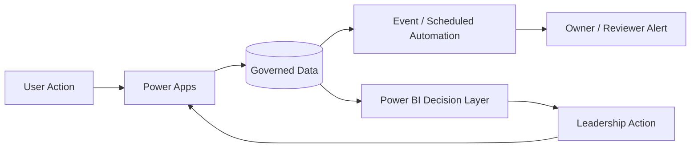

# Faith Paulding | Real-Time Federal Digital Transformation Portfolio

## Government Contracting Positions I Am Aligned For

My résumé, technical delivery experience, leadership background, certifications, and the solution portfolio documented in this repository create alignment across a broad range of government-contracting roles. Rather than limiting my candidacy to a single technical lane, my experience spans **technical program leadership, data and business intelligence, Power Platform architecture, digital transformation, financial-management modernization, audit readiness, AI architecture, cybersecurity-aware delivery, governance, and enterprise analysis.**

### Technical Program Management, Transformation & Agile Delivery
- Senior Technical Program Manager
- Technical Program Manager — Data / Analytics
- Technical Program Manager — Power Platform / Automation
- Technical Program Manager — AI / Emerging Technology
- Data Analytics Program Manager
- Digital Transformation Lead
- Digital Transformation Manager
- Technology Modernization Program Manager
- Enterprise Modernization Lead
- Agile Delivery Manager — IT / Data
- Senior Program Analyst
- Senior Management Analyst
- Program Controls Analyst
- Business Systems Analyst — DoD / Federal
- Technical Business Analyst
- Enterprise Business Analyst
- Requirements / Process Modernization Lead

### Data, Business Intelligence & Analytics
- BI / Data Analytics Lead
- Senior BI Developer
- Senior Data Analyst
- Lead Data Analyst
- Data Analytics Lead
- Data Analytics Program Manager
- Power BI Lead / Developer
- Business Intelligence Manager
- Data Visualization Lead
- Data Governance Lead
- Data Quality Lead
- Data Governance / Data Quality Manager
- Analytics Modernization Consultant
- Executive Reporting / Decision Support Analyst
- Performance Management Analyst
- Program Performance Analyst
- Data Integration Analyst
- Reporting & Analytics Consultant

### Microsoft Power Platform & Enterprise Automation
- Power Platform Solution Architect
- Enterprise Power Platform Architect
- Senior Power Platform Developer
- Power Apps Developer
- Power Automate Developer
- Low-Code Solution Architect
- Workflow Automation Lead
- Automation / Workflow Solutions Lead
- Microsoft 365 Solutions Consultant
- SharePoint / Power Platform Solutions Analyst
- Business Applications Solution Architect
- Power Platform Governance Lead
- Power Platform ALM Lead
- Intelligent Automation Consultant

### Financial Management, PPBE & Resource Analytics
- Financial Management Business Analyst
- Financial Systems Analyst
- Financial Data / BI Analyst
- Financial Management Modernization Consultant
- Financial Systems Modernization Analyst
- Business Financial Manager
- Resource Management Analyst
- PPBE Analyst / Consultant
- PPBE Data / Analytics Analyst
- Program Financial Analyst
- Program Controls Analyst
- Budget / Program Analytics Consultant
- Financial Reporting Analyst
- Financial Data Analyst
- Budget Execution Analytics Analyst
- Financial Transformation Consultant
- Resource / Program Decision Support Analyst

### Audit, Compliance, Risk & Governance
- Audit Readiness Analyst
- Audit Remediation Analyst
- Audit Readiness / Remediation Analyst
- Audit Data Analytics Lead
- Audit Management Systems Analyst
- Corrective Action / Remediation Analyst
- Governance, Risk & Compliance Analyst
- Data Governance Lead
- Compliance Technology Analyst
- Internal Controls / Process Improvement Analyst
- Risk & Controls Analyst
- Program Governance Analyst
- Technology Governance Lead
- Digital Governance Consultant

### AI Architecture, AI Modernization & Responsible AI
- AI Technical Program Manager
- AI / Data Modernization Lead
- AI Solutions Architect
- Enterprise AI Architect
- AI Transformation Manager
- AI Modernization Consultant
- AI Governance Lead
- Responsible AI Lead
- AI Governance / Responsible AI Lead
- AI Risk Consultant
- AI Program Manager
- AI Business Systems Analyst
- AI Implementation / Adoption Lead
- AI Data Governance Lead
- Emerging Technology Program Manager

### Cybersecurity-Aware Technology & Governance Roles
- Cybersecurity Program Analyst
- Cybersecurity Business Analyst
- Cybersecurity Data Analyst
- Cybersecurity Governance Analyst
- Security / Technology Governance Analyst
- Cyber Risk & Controls Analyst
- Cybersecurity Modernization Analyst
- Security Data / BI Analyst
- Cybersecurity Technical Program Support
- Secure Digital Transformation Consultant

### Federal Program, Performance & Management Consulting
- Federal Management Consultant
- Senior Program Management Consultant
- Federal Digital Transformation Consultant
- Government Technology Consultant
- Program Management Analyst
- Program Performance Analyst
- Management & Program Analyst
- Business Process Reengineering Analyst
- Process Improvement Lead
- Performance Management Consultant
- Program Modernization Analyst
- Enterprise Transformation Consultant
- Decision Support Analyst

## Why This Range Is Credible

The breadth of these roles is supported by the intersection of my résumé and this portfolio: technical program delivery, Air Force/DoD modernization experience, audit-management and corrective-action workflows, requirements and process mapping, Power Apps, Power Fx, Power Automate, SharePoint, Power BI, DAX, Power Query, SQL, Excel, Tableau, data modeling, automation, governance, executive reporting, Agile delivery, and enterprise solution design. Moreover, my **MBA in Engineering Management, Certified ScrumMaster credential, IBM Cybersecurity Certification, and IBM AI Architecture Certification** strengthen the bridge between technology execution, management, risk, and emerging-technology modernization.

Not every position requires the same depth in every competency. Accordingly, this portfolio is structured to let a hiring manager move directly from a target role to evidence of the problems I can analyze, the solutions I can architect, the execution plans I can develop, and the results I would measure.

> **Remote contracting alignment:** Many of these functions are highly compatible with remote delivery—particularly analytics, Power Platform development, architecture, Agile delivery, governance, financial-management analysis, audit remediation, AI architecture, and documentation—when the contract permits remote work and authorized systems can be accessed securely. Customer, clearance, classified-network, and site-specific requirements ultimately determine work location.

---

**Data & BI • Power Platform • AI Architecture • Cybersecurity • Financial Management Modernization**

I rebuilt this portfolio around the way I approach an actual delivery environment: **identify the operational challenge, define the result that matters, establish the plan, execute the solution, and measure whether the operating condition improved.** Technology is the enabler; the outcome is the point.

> **Portfolio integrity:** All organizations, records, financial values, metrics, and scenarios are fictional or sanitized. Any results shown below are **demonstration targets or simulated outcomes**, not claims about an actual government customer.

## Delivery Framework

**Challenge → Desired Result → Plan → Execution → Real-Time Control → Measured Result → Next Decision**

This structure matters because a solution is not complete when an app or dashboard is published. In practice, the solution has to detect change, route work, surface risk, preserve accountability, and give leadership enough information to act while the issue is still manageable.

## Portfolio: Real-Time Problems and Solutions

| Solution | Real-Time Challenge | Plan & Execution | Demonstration Result |
|---|---|---|---|
| Government Audit & Compliance Management | Deficiencies, CAPs, evidence, and deadlines change faster than manual trackers | Govern lifecycle, automate status/alerts, connect evidence, surface exceptions | Earlier overdue visibility; traceable closure readiness; fewer manual status checks |
| [Federal Financial Management Analytics](Federal-Financial-Management-Analytics/README.md) | Funding execution and forecasts change throughout the fiscal cycle | Integrate budget/execution data, calculate variance, trigger threshold views | Faster variance identification and decision-ready funding visibility |
| [PPBE Program Analytics](PPBE-Program-Analytics/README.md) | Requirements, resources, execution, and program risk are evaluated separately | Connect planning assumptions to execution and forecast signals | Leadership sees resource pressure before it becomes a year-end surprise |
| [Enterprise AI Architecture](Enterprise-AI-Architecture/README.md) | AI responses, access, and risk must be controlled at runtime | Layer identity, retrieval, safeguards, telemetry, and human review | Traceable AI interactions and faster detection of unsafe or unsupported behavior |
| [AI RMF Governance](NIST-AI-RMF-Governance/README.md) | AI risk changes after initial approval | Operationalize Govern/Map/Measure/Manage with monitoring and escalation | Continuous risk visibility instead of one-time governance review |
| [Power Platform Enterprise Architecture](Power-Platform-Enterprise-Architecture/README.md) | Low-code change can reach users faster than governance can respond | Dev/Test/Prod, ALM, DLP, monitoring, ownership, support | More controlled releases and faster response to production issues |
| [Executive BI Analytics](Executive-BI-Analytics-Portfolio/README.md) | Leaders receive stale or inconsistent performance measures | Govern KPIs, refresh data, calculate exceptions, enable drill-down | One decision layer for current health, trend, forecast, and ownership |
| [Federal Digital Transformation Playbook](Federal-Digital-Transformation-Playbook/README.md) | Modernization efforts can automate the wrong process | Diagnose current state, prioritize pain points, execute in phases, measure adoption | Modernization tied to operating outcomes rather than technology deployment alone |
| [Federal Program Performance Command Center](Federal-Program-Performance-Command-Center) | Cost, schedule, milestone, risk, and corrective-action signals are disconnected | Integrate operational records and calculate program health | Earlier intervention through exception and 30/60/90-day views |
| [Government Service Request & Approval Portal](Government-Service-Request-Approval-Portal) | Requests stall because ownership, approvals, and SLAs are unclear | State-based workflow, routing, alerts, audit history, SLA analytics | Reduced handoff ambiguity and real-time request accountability |

## What “Real-Time” Means in This Portfolio

Real-time does not mean every source refreshes every second. It means the solution is designed so that **when an approved source changes, the operating model can detect, validate, calculate, route, alert, or refresh at the cadence the business process requires.** That may be event-driven for workflow actions, scheduled for financial feeds, or near-real-time for operational dashboards.

## Credentials & Technical Foundation

MBA, Engineering Management • Certified ScrumMaster (CSM) • IBM Cybersecurity Certification • IBM AI Architecture Certification • Power BI • Power Apps • Power Automate • Power Fx • SharePoint • Dataverse • DAX • Power Query • SQL • Python • Tableau • SSRS • Excel/Power Pivot

# Government Audit & Compliance Management System

## Challenge
Audit records can move through intake, review, recommendations, corrective actions, milestones, evidence, and closure while information remains distributed across email, spreadsheets, trackers, and documents. The operational risk is not only duplication; it is delayed awareness of what changed and whether closure is actually supportable.

## Desired Result
Create one governed lifecycle in which leadership can see current status, overdue exposure, ownership, evidence readiness, and the next required action without reconstructing the record manually.

## Plan
1. Establish a source-of-truth data model: Deficiency → Recommendation → CAP → Milestone → Evidence.
2. Define workflow states, ownership, validation, and closure criteria.
3. Automate event-driven notifications, audit history, and escalation.
4. Build exception-driven Power BI views and 30/60/90-day forecasting.
5. Test role-based access, transitions, failure paths, and closure gates.

## Execution
Power Apps handles intake/review/management; Power Automate records transitions and routes alerts; SharePoint/Dataverse stores governed records and evidence references; Power BI calculates health, overdue exposure, completion, and forecast measures.

## Demonstration Results
- A status change can immediately create history and route the next action.
- Overdue and approaching ECD conditions become visible without manual spreadsheet review.
- Closure can be blocked until required downstream actions/evidence are complete.
- Leadership can drill from portfolio health to the specific record driving the exception.

## Result Measures
Time from submission to review • overdue count • aging by workflow state • CAP completion rate • evidence completeness • returned/rejected rate • closure cycle time • 30/60/90-day exposure

## Career Alignment
Power Platform Solution Architect • Senior Technical Program Manager • Audit Readiness/Remediation • Digital Transformation Lead • BI/Data Analytics Lead

---
**Faith Paulding** — Federal Digital Transformation • Data & BI • Power Platform • AI Architecture • Cybersecurity • Financial Management Modernization
