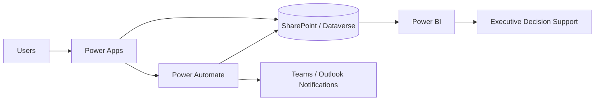

# Faith Paulding | Federal Digital Transformation Portfolio

**Data & BI • Power Platform • AI Architecture • Cybersecurity • Financial Management Modernization**

I built this portfolio to show more than a list of tools. My work is centered on a larger question: **How do you take a fragmented business problem, understand the operational risk behind it, and translate it into a solution that leadership can actually use?**

My approach sits at the intersection of technical delivery, data strategy, program management, governance, and modernization. Consequently, each project demonstrates the challenge, the solution I designed, why that solution fits the problem, and the professional capability it represents.

> **Portfolio integrity statement:** Every organization, user, financial record, audit record, metric, screenshot, workflow, and dataset presented here is fictional or intentionally sanitized for demonstration. No classified, controlled, proprietary, customer-sensitive, or government-sensitive information is included.

## My Professional Lens

From a technical standpoint, I work across Microsoft Power Platform, Power BI, automation, data modeling, SQL, analytics, governance, and enterprise workflow design. Equally important, I approach technology through the lens of program outcomes: the solution has to improve visibility, reduce manual effort, strengthen controls, and give decision-makers a clearer path forward.

Moreover, my IBM AI Architecture and IBM Cybersecurity certifications allow me to evaluate modernization from an emerging-technology and risk-aware perspective. Rather than treating AI, cybersecurity, data, and automation as separate disciplines, I view them as interconnected components of responsible enterprise architecture.

## Challenge → Solution Portfolio Map

| Portfolio Challenge | Solution | Capability Demonstrated |
|---|---|---|
| Fragmented audit records, manual approvals, and weak closure traceability | Governed audit lifecycle with Power Apps, automation, relational tracking, evidence, and executive reporting | Power Platform Architecture • Audit Modernization • Technical Program Leadership |
| Financial data exists but leadership lacks timely execution visibility | Financial analytics model connecting budget, obligations, expenditures, variance, forecasts, and risk | Financial BI • Data Modeling • Financial Modernization |
| Requirements, resources, execution, and program health are evaluated separately | PPBE-style decision-support model connecting planning, funding, execution, forecast, and program health | PPBE Analytics • Resource Management • Program Analysis |
| AI adoption can outpace security, governance, and accountability | Layered enterprise AI architecture with controlled retrieval, identity, telemetry, safeguards, and human oversight | AI Architecture • Cybersecurity • AI Technical Leadership |
| AI use cases lack consistent ownership, assessment, evidence, and monitoring | NIST AI RMF-aligned governance lifecycle using Govern, Map, Measure, and Manage | Responsible AI • AI Governance • Risk & Controls |
| Low-code applications scale faster than enterprise governance | Dev/Test/Prod Power Platform architecture with ALM, DLP, ownership, security, and lifecycle controls | Power Platform Solution Architecture • Governance • ALM |
| Multiple reports exist but executive performance remains difficult to interpret | Dimensional BI model with governed KPIs, exception reporting, drill-down, and 30/60/90 forecasting | BI Leadership • Analytics Strategy • Executive Decision Support |
| Modernization efforts begin with technology before the operating problem is understood | Current-state → target-state transformation framework connecting people, process, data, technology, governance, and delivery | Digital Transformation • Technical Program Management • Change Leadership |

## Career Alignment

This portfolio intentionally supports senior government-contractor opportunities including Senior Technical Program Manager, Power Platform Solution Architect, BI / Data Analytics Lead, Digital Transformation Lead, Senior Power Platform Developer, Financial Management Business Analyst, Financial Systems Analyst, Financial Data / BI Analyst, Audit Readiness / Remediation Analyst, AI Technical Program Manager, AI / Data Modernization Lead, and AI Governance / Responsible AI Lead.

## Credentials Represented

- MBA, Engineering Management
- Certified ScrumMaster (CSM)
- IBM Cybersecurity Certification
- IBM AI Architecture Certification
- Power BI / SQL / Data Analytics credentials and experience
- Microsoft Power Platform, SharePoint, Power Automate, Power Apps, Power Fx, DAX, Power Query, SQL, Python, Tableau, SSRS, and Excel / Power Pivot

## Portfolio Projects

| Project | Strategic Question | Career Alignment |
|---|---|---|
| [Government Audit & Compliance Management System](#government-audit--compliance-management-system) | How can fragmented audit activity become a traceable, governed lifecycle? | Power Platform Architect, Technical PM, Audit Readiness |
| [Federal Financial Management Analytics](Federal-Financial-Management-Analytics/README.md) | How can funding execution and variance become actionable leadership intelligence? | Financial Data/BI, Financial Systems, FM Business Analyst |
| [PPBE Program Analytics](PPBE-Program-Analytics/README.md) | How can requirements, resources, execution, and program health be viewed together? | PPBE Analyst, BFM, Resource Management |
| [Enterprise AI Architecture](Enterprise-AI-Architecture/README.md) | How can AI be introduced without losing security, traceability, or human accountability? | AI Architect, AI TPM, AI Modernization |
| [AI RMF Governance](NIST-AI-RMF-Governance/README.md) | How should AI risk be governed from intake through monitoring? | AI Governance, Responsible AI, Cyber/AI |
| [Power Platform Enterprise Architecture](Power-Platform-Enterprise-Architecture/README.md) | How can low-code solutions scale beyond a single app? | Power Platform Solution Architect |
| [Executive BI Analytics Portfolio](Executive-BI-Analytics-Portfolio/README.md) | How can raw operational data become a leadership decision system? | BI Lead, Data Analytics Lead |
| [Federal Digital Transformation Playbook](Federal-Digital-Transformation-Playbook/README.md) | How do you move from current-state friction to a governed modernization roadmap? | Digital Transformation Lead, Technical Program Manager |

---

# Government Audit & Compliance Management System

## Challenge

Audit-management environments can become difficult to govern when information is distributed across spreadsheets, emails, manual approvals, disconnected trackers, and legacy systems. As a result, leadership may have limited visibility into overdue deficiencies, corrective-action progress, ownership, evidence, and closure readiness. Moreover, a status can appear complete even when the supporting actions or documentation are not.

## Solution

I designed a sanitized PL-600-style management solution using Power Apps, Power Automate, Power BI, SharePoint, Power Fx, and Microsoft 365. The model centralizes intake, internal review, recommendations, corrective actions, milestones, evidence, status history, alerts, and executive reporting.

Most importantly, closure is treated as a controlled outcome rather than a manual status selection.

## Challenge-to-Solution Alignment

| Audit Challenge | Solution I Designed |
|---|---|
| Intake arrives through inconsistent channels | Structured external intake workflow |
| Required information is incomplete | Field validation and conditional requirements |
| Review decisions are difficult to trace | Internal review workflow with status history |
| Deficiencies and corrective actions become disconnected | Relational Deficiency → Recommendation → CAP → Milestone structure |
| Owners miss upcoming deadlines | Automated notifications and 30/60/90 forecasting |
| Closure can occur without complete evidence | Completion and evidence gates before closure |
| Leadership lacks portfolio visibility | Power BI executive dashboards and exception reporting |
| Data terminology becomes inconsistent | Standardized fields, controlled values, and source-of-truth structures |

## Application Workflows

1. **External Intake** — captures new submissions, validates required information, creates tracking numbers, and supports draft behavior.
2. **Internal Review** — provides structured validation, correction, approval, rejection, and return pathways.
3. **Recommendations & Corrective Actions** — establishes relationships between deficiencies, recommendations, CAP actions, owners, milestones, evidence, and completion dates.
4. **Deficiency Management & Closure** — confirms that required actions, documentation, milestones, and approvals are complete before closure.

## Reference Architecture

## Why the Solution Fits the Challenge

From an architectural standpoint, the application is only one layer. The actual solution is the relationship between workflow, data, governance, reporting, and auditability. Accordingly, the model emphasizes source-of-truth data, least-privilege access, traceable status transitions, evidence linkage, data-quality validation, and controlled closure.

Ultimately, my objective is not simply to digitize a manual process. It is to create an operating structure in which activity becomes measurable, accountability becomes visible, and leadership can identify where intervention is required before an issue becomes larger.

---

**Faith Paulding**  
Federal Digital Transformation • Data & BI • Power Platform • AI Architecture • Cybersecurity • Financial Management Modernization
