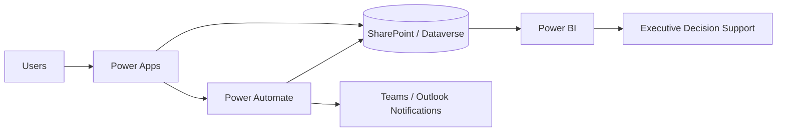

# Faith Paulding | Federal Digital Transformation Portfolio

**Data & BI • Power Platform • AI Architecture • Cybersecurity • Financial Management Modernization**

This public portfolio demonstrates how I approach complex federal-style modernization problems through data architecture, business intelligence, workflow automation, program management, AI governance, and secure solution design.

> **Portfolio safety statement:** All organizations, users, systems, financial records, audit records, metrics, screenshots, and datasets in this repository are fictional or sanitized for demonstration. No government-sensitive, proprietary, classified, controlled, or customer data is included.

## Professional Alignment

This portfolio is intentionally structured around contractor roles such as:

- Senior Technical Program Manager
- Power Platform Solution Architect
- BI / Data Analytics Lead
- Digital Transformation Lead
- Senior Power Platform Developer
- Financial Management Business Analyst
- Financial Systems Analyst
- Financial Data / BI Analyst
- Audit Readiness / Remediation Analyst
- AI Technical Program Manager
- AI / Data Modernization Lead
- AI Governance / Responsible AI Lead

## Credentials Represented

- MBA, Engineering Management
- Certified ScrumMaster (CSM)
- IBM Cybersecurity Certification
- IBM AI Architecture Certification
- Power BI / SQL / Data Analytics experience
- Microsoft Power Platform, SharePoint, Power Automate, Power Apps, Power Fx, DAX, Power Query, SQL, Python, Tableau, SSRS, Excel / Power Pivot

## Portfolio Projects

| Project | What It Demonstrates | Career Alignment |
|---|---|---|
| [Government Audit & Compliance Management System](#government-audit--compliance-management-system) | Audit intake, corrective actions, workflows, governance, executive reporting | Power Platform Architect, Technical PM, Audit Readiness |
| [Federal Financial Management Analytics](Federal-Financial-Management-Analytics/README.md) | Budget execution, variance, forecasting, executive BI | Financial Data/BI, Financial Systems, FM Business Analyst |
| [PPBE Program Analytics](PPBE-Program-Analytics/README.md) | Planning, programming, budgeting, execution, program health | PPBE Analyst, BFM, Resource Management |
| [Enterprise AI Architecture](Enterprise-AI-Architecture/README.md) | AI reference architecture, secure data flow, architecture decisions | AI Architect, AI TPM, AI Modernization |
| [AI RMF Governance](NIST-AI-RMF-Governance/README.md) | Govern, Map, Measure, Manage controls and AI risk register | AI Governance, Responsible AI, Cyber/AI |
| [Power Platform Enterprise Architecture](Power-Platform-Enterprise-Architecture/README.md) | Dev/Test/Prod, ALM, governance, security, integration | Power Platform Solution Architect |
| [Executive BI Analytics Portfolio](Executive-BI-Analytics-Portfolio/README.md) | KPI design, star schema, executive dashboards, forecasting | BI Lead, Data Analytics Lead |
| [Federal Digital Transformation Playbook](Federal-Digital-Transformation-Playbook/README.md) | Current/future state, roadmap, governance, Agile delivery | Digital Transformation Lead, Technical Program Manager |

---

# Government Audit & Compliance Management System

A sanitized PL-600-style portfolio solution demonstrating a government audit and compliance management system built with Power Apps, Power Automate, Power BI, SharePoint, Power Fx, and Microsoft 365.

## Business Challenge

Government organizations may experience disconnected audit records, manual intake and approval processes, inconsistent naming, limited visibility into overdue deficiencies, weak corrective-action tracking, and time-consuming executive reporting.

## Proposed Solution

The solution provides centralized audit intake, internal review, recommendation and corrective-action management, milestone/ECD tracking, audit history, automated reminders, 30/60/90-day forecasting, and interactive Power BI reporting.

## Application Workflows

1. **External Intake** — capture submissions, validate required information, create tracking numbers, and support drafts.
2. **Internal Review** — validate, correct, approve, reject, or return submitted records.
3. **Recommendations & Corrective Actions** — connect deficiencies to recommendations, CAP actions, owners, milestones, evidence, and dates.
4. **Deficiency Management & Closure** — verify recommendations, CAPs, milestones, evidence, and approvals before closure.

## Microsoft Technology Stack

| Technology | Solution Role |
|---|---|
| Power Apps | Responsive workflow application |
| Power Fx | Validation, navigation, filtering, and business logic |
| Power Automate | Notifications, approvals, audit trails, and escalation |
| SharePoint Online | Structured lists and document management |
| Dataverse | Enterprise relational data option |
| Power BI | Executive dashboards and forecasting |
| Power Query | Data transformation and quality |
| DAX | KPIs, overdue logic, and forecasts |
| SQL | Data integration and reporting support |
| Microsoft Teams | Collaboration and alerts |

## Reference Architecture

## Design Principles

- Least-privilege access
- Traceable status transitions
- Source-of-truth data structures
- Controlled closure logic
- Evidence and document linkage
- Data quality validation
- Executive visibility without exposing sensitive content
- Fictional demonstration data only

---

**Faith Paulding**  
Federal Digital Transformation • Data & BI • Power Platform • AI Architecture • Cybersecurity • Financial Management Modernization
